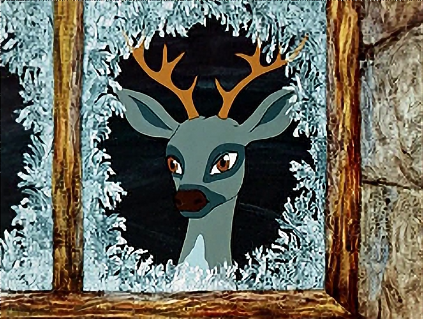
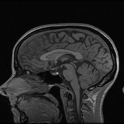
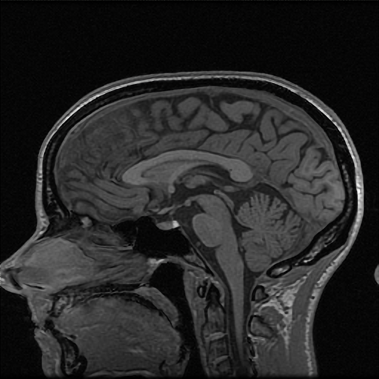

# Image super resolution practice with Intel OpenVINO

This project is designed as practicing challenge for everyone interested in Intel OpenVINO toolkit. It demonstrates
* OpenVINO's super resolution network adopted to work on varying input resolutions.
* Complete sample to upscale a single image (x3)

## Project structute

* `data` - a folder with visual data (images, video)
* `superres_img.py` - script to run super resolution for image
* `superres_mri.py` - MRI visualization script

## Setup

1. Download and install OpenVINO: https://software.seek.intel.com/openvino-toolkit

2. Download model
  * [single-image-super-resolution-1033.bin](https://download.01.org/opencv/2020/openvinotoolkit/2020.1/open_model_zoo/models_bin/1/single-image-super-resolution-1033/FP32/single-image-super-resolution-1033.bin)
  * [single-image-super-resolution-1033.xml](https://download.01.org/opencv/2020/openvinotoolkit/2020.1/open_model_zoo/models_bin/1/single-image-super-resolution-1033/FP32/single-image-super-resolution-1033.xml)

3. Setup environment

    * Windows
      ```bash
      "C:\Program Files (x86)\IntelSWTools\openvino\bin\setupvars.bat"
      ```
      Expected output:
      ```bash
      Python 3.7.6
      ECHO is off.
      PYTHONPATH=C:\Program Files (x86)\IntelSWTools\openvino\deployment_tools\open_model_zoo\tools\accuracy_checker;C:\Program Files (x86)\IntelSWTools\openvino\python\python3.7;C:\Program Files (x86)\IntelSWTools\openvino\python\python3;C:\Users\dkurtaev\opencv\build\lib\Release
      [setupvars.bat] OpenVINO environment initialized
      ```

    * Linux
      ```bash
      source /opt/intel/openvino/bin/setupvars.sh
      ```
      Expected output:
      ```bash
      [setupvars.sh] OpenVINO environment initialized
      ```

## Single image run

```bash
python3 superres_img.py -i data/sample.png
```

Source image (click to expand):  


 Bicubic interpolation | Network output
----------|--------------
 |  |

---

```bash
python3 superres_img.py -i data/mri.png
```

Source image (click to expand):  



 Bicubic interpolation | Network output
----------|--------------
 |  |

source: [Calgary-Campinas Public Brain MR Dataset](https://sites.google.com/view/calgary-campinas-dataset/home)


## Practice

1. Create a script `superres_video.py` based on `superres_img.py` which can process
video file `data/video.mp4` and show three windows: source video, resized with `cv.INTER_CUBIC` and
upscaled by OpenVINO network.

2. Extend `superres_mri.py` so it could show both `cv.INTER_CUBIC` and output from
OpenVINO network (on different windows or in a single window).
